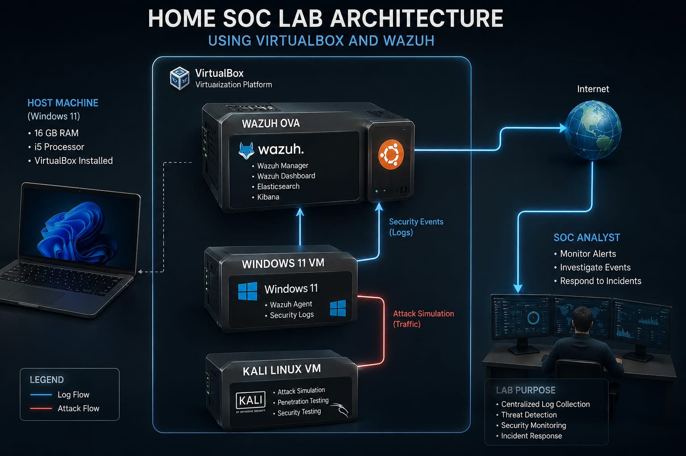

# 🛡️ Home SOC Lab Using Wazuh

## Overview

This project demonstrates the design and implementation of a Home Security Operations Center (SOC) Lab using Wazuh, VirtualBox, Windows 11, and Kali Linux.

The objective of this lab is to gain hands-on experience with Security Information and Event Management (SIEM), log collection, endpoint monitoring, threat detection, and incident investigation in a controlled environment.

---

## Lab Architecture



### Components

| Component                 | Purpose                                   |
| ------------------------- | ----------------------------------------- |
| Host Machine (Windows 11) | Runs VirtualBox and hosts the lab         |
| VirtualBox                | Virtualization platform                   |
| Wazuh OVA                 | SIEM platform for monitoring and analysis |
| Windows 11 VM             | Monitored endpoint                        |
| Kali Linux VM             | Attack simulation and testing             |

---

## Architecture Workflow

1. Windows 11 VM generates security events.
2. Wazuh Agent forwards logs to the Wazuh Manager.
3. Wazuh analyzes and correlates events.
4. Security alerts are generated within the Wazuh Dashboard.
5. Kali Linux is used to simulate attack activities.
6. The SOC Analyst investigates alerts and incidents.

---

## Technologies Used

* Wazuh SIEM
* VirtualBox
* Windows 11
* Kali Linux
* Windows Event Logs
* Linux System Logs
* Cybersecurity Monitoring

---

## Environment Setup

### Host System

* Windows 11
* 16 GB RAM
* VirtualBox

### Virtual Machines

#### Wazuh OVA

* Wazuh Manager
* Wazuh Dashboard
* Elasticsearch

#### Windows 11 VM

* Registered as Wazuh Agent
* Generates Windows security events

#### Kali Linux VM

* Used for security testing
* Used for attack simulation

---

## Agent Enrollment

The Windows 11 virtual machine was successfully enrolled as a Wazuh Agent and connected to the Wazuh Manager.

### Verification

* Agent status displayed as Active
* Logs successfully received by Wazuh Dashboard

---

# Security Event Simulation

To validate monitoring capabilities, several security-related activities were performed.

---

## Use Case 1: Failed Login Attempts

### Objective

Validate authentication monitoring.

### Activity

Multiple incorrect passwords were entered during Windows login.

### Detection

Wazuh generated authentication failure alerts.

### Result

Successful detection of failed login attempts.

---

## Use Case 2: Account Creation

### Objective

Validate account management monitoring.

### Activity

A new local Windows user account was created.

```cmd
net user testuser Password123! /add
```

### Detection

Wazuh detected account creation activity.

### Result

Successful monitoring of user account creation.

---

## Use Case 3: Account Deletion

### Objective

Validate account lifecycle monitoring.

### Activity

The test user account was deleted.

```cmd
net user testuser /delete
```

### Detection

Wazuh detected account deletion activity.

### Result

Successful monitoring of account deletion events.

---

# Evidence

## Screenshots

Store screenshots inside the `screenshots/` directory.

Examples:

* Agent Connected
* Wazuh Dashboard
* Failed Login Alert
* User Creation Alert
* User Deletion Alert
* Threat Hunting View

---

# Findings

The Home SOC Lab successfully demonstrated:

* Centralized log collection
* Endpoint monitoring
* Authentication monitoring
* User account auditing
* Security alert generation
* Basic incident investigation

---

# Challenges Encountered

* VirtualBox network configuration
* Agent registration troubleshooting
* Log forwarding verification

All issues were resolved through configuration validation and connectivity testing.

---

# Lessons Learned

This project provided practical experience with:

* SIEM deployment
* Wazuh administration
* Endpoint monitoring
* Security event analysis
* Incident investigation workflow
* Cybersecurity documentation

---

# Future Improvements

* Install Sysmon for advanced telemetry
* Add Linux endpoint monitoring
* Create custom Wazuh detection rules
* Simulate attacks using Atomic Red Team
* Perform threat hunting exercises
* Build incident response playbooks

---

# Repository Structure

```text
Home-SOC-Lab/
│
├── README.md
├── Architecture/
│   └── SOC-Architecture.png
│
├── Incident-Reports/
│   ├── Failed-Login-Report.md
│   ├── User-Creation-Report.md
│   └── User-Deletion-Report.md
│
├── Screenshots/
│   ├── Agent-Connected.png
│   ├── Failed-Login-Alert.png
│   ├── User-Creation-Alert.png
│   └── User-Deletion-Alert.png
│
└── Documentation/
    └── Home-SOC-Lab-Report.docx
```

---

## Author

**Hemanth Taduku**

Home SOC Lab Project | Wazuh SIEM | Security Monitoring | SOC Analyst Portfolio
